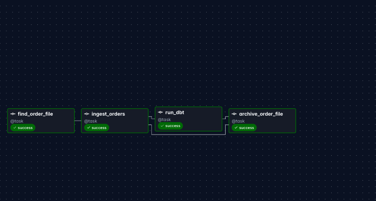
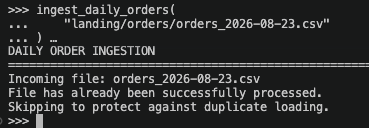
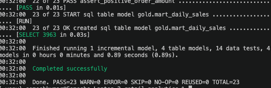
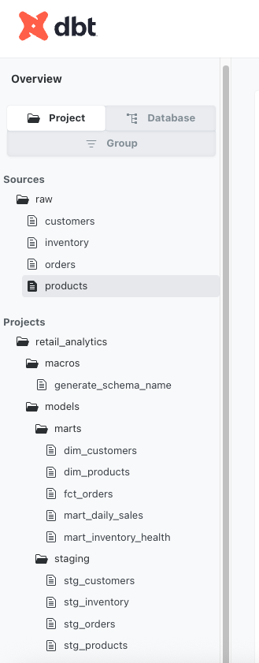
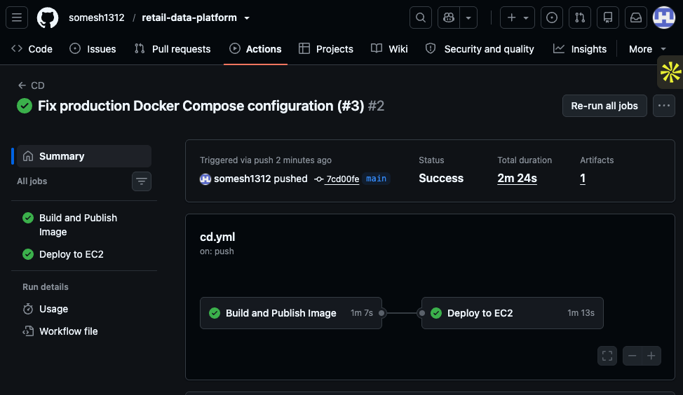
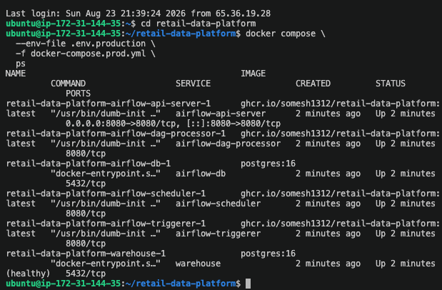

# Retail Data Platform

**Python · SQL · dbt · Apache Airflow · PostgreSQL · Docker · GitHub Actions · AWS EC2**

A production-style retail data platform that ingests heterogeneous operational data, processes daily order batches incrementally, transforms warehouse data through dbt, enforces data-quality gates, orchestrates workflows with Apache Airflow, and ships through an automated CI/CD pipeline — deployed to AWS EC2.

---

## Why This Exists

A basic data pipeline can move data from A to B. This project is deliberately built around the harder questions that surface *after* an ETL pipeline works once:

- What happens when the same batch arrives twice?
- How do we avoid rebuilding historical data every day?
- What happens when a transformation violates a business rule?
- When should a source file be considered "successfully processed"?
- How do application code, orchestration, containers, and databases move together between environments?
- How does a code change get validated before it reaches a running environment?

Every architectural choice in this repository traces back to at least one of these questions.

---

## What This Project Demonstrates

> *A pipeline is not complete when the happy path works. It is complete when retries are safe, failures are visible, data quality is enforced, and the runtime can be reproduced outside the developer's machine.*

| Capability | What I Built |
|---|---|
| **Source Integration** | Four heterogeneous sources (CSV batch, JSON/API, relational DB, inventory feed) converging through a unified Python ingestion layer |
| **Idempotent Ingestion** | Processing-history tracking that prevents duplicate loads on retries, reruns, or accidental redelivery |
| **Incremental Modeling** | dbt fact model that merges new/changed orders without rebuilding history |
| **Data Quality Gates** | 23 dbt tests (uniqueness, not-null, accepted values, referential integrity, business rules) that block bad data from reaching analytical models |
| **Warehouse Design** | Three-layer architecture (RAW → SILVER → GOLD) separating ingestion, standardization, and business logic |
| **Orchestration** | Airflow DAG with explicit task dependencies and clear failure boundaries |
| **CI/CD** | GitHub Actions pipeline — tests, dbt validation, and Docker build on PR; automated image build and deployment to AWS EC2 on merge |
| **Containerization** | Reproducible Docker runtime with separate development and production Compose configurations |
| **Cloud Deployment** | Full stack deployed to AWS EC2 via automated CD pipeline with scoped IAM permissions |

---

## System Architecture

```
                         RETAIL SOURCE SYSTEMS
           Orders CSV        Product Catalog       Customer DB
               │                JSON / API              │
               │                    │                   │
               └────────────────────┼───────────────────┘
                                    │
                                    ▼
                           Python Ingestion
                          (validation + idempotency)
                                    │
                                    ▼
                          PostgreSQL Warehouse
                                    │
                    ┌───────────────┴───────────────┐
                    │                               │
                   RAW                             dbt
                    │                               │
                    ▼                               ▼
                 SILVER ───────────────────────►   GOLD
                                                    │
                                 ┌──────────────────┼─────────────────┐
                                 │                  │                 │
                          dim_customers       dim_products       fct_orders
                                                                     │
                                               ┌─────────────────────┴───────────────┐
                                               │                                     │
                                      mart_daily_sales                  mart_inventory_health
```

---

## End-to-End Daily Lifecycle

A daily orders file arrives in `landing/orders/orders_YYYY-MM-DD.csv`. Airflow then coordinates the full processing lifecycle:

```
find_order_file ──► ingest_orders ──► run_dbt ──► archive_order_file
```

**Each step creates a clear failure boundary.** If `run_dbt` fails:

| Task | Status |
|---|---|
| find_order_file | ✅ |
| ingest_orders | ✅ |
| run_dbt | ❌ |
| archive_order_file | ⏸ |

The source batch remains available for investigation instead of being silently treated as processed. A file is archived **only** after downstream transformation and validation succeed.



---

## Multi-Source Ingestion

The platform intentionally combines different source types rather than assuming every upstream system delivers identical files.

| Source | Input Style | Purpose |
|---|---|---|
| Orders | Daily CSV batch | Transactional sales |
| Customers | Separate operational database | Customer master data |
| Products | JSON / API-style source | Product catalog |
| Inventory | Independent inventory feed | Stock availability |

```
Orders CSV ───────────────┐
                          │
Product JSON / API ───────┤
                          ├──► Python ingestion ──► PostgreSQL
Customer Database ────────┤
                          │
Inventory Feed ───────────┘
```

Keeping ingestion separate from analytical modeling allows each source to evolve independently while dbt provides a standardized downstream transformation layer.

---

## Idempotent Ingestion

A pipeline retry should not create duplicate business data. The ingestion layer records successfully processed batches and checks processing history before loading.

```
Run #1:  5,000 existing + 200 new orders  →  5,200 ✅
Run #2:  Same file arrives again          →  5,200 ✅  (not 5,400)
```

```
Incoming file: orders_2026-08-23.csv
File has already been successfully processed.
Skipping to protect against duplicate loading.
```

This protects against Airflow retries, manual reruns, accidental file redelivery, and operators triggering the same batch twice.



---

## Warehouse Design

The warehouse follows a three-layer modeling approach. Each layer has a distinct responsibility.

### RAW — Source Preservation

Source-aligned records with minimal transformation. RAW preserves the boundary between ingestion and analytics logic.

`raw.customers` · `raw.inventory` · `raw.orders` · `raw.products`

### SILVER — Standardization & Cleaning

dbt staging models handling type normalization, field standardization, basic cleaning, consistent naming, and source-level validation.

`silver.stg_customers` · `silver.stg_inventory` · `silver.stg_orders` · `silver.stg_products`

### GOLD — Business-Facing Models

Analytical models designed for downstream consumption rather than mirroring operational source structures.

`gold.dim_customers` · `gold.dim_products` · `gold.fct_orders` · `gold.mart_daily_sales` · `gold.mart_inventory_health`

The goal is to move consumers away from raw operational structures and toward stable analytical contracts.

---

## Incremental Processing

`fct_orders` is implemented as an incremental dbt model. The pipeline does not rebuild the entire historical order fact table every time new sales arrive.

```
Existing warehouse:  5,000 historical orders
                          │
                          │  + 250 new/changed orders
                          ▼
                  Incremental merge (order_id as key)
                          │
                          ▼
                  Updated fact table
```

Existing orders are updated in place while genuinely new orders are inserted. This becomes increasingly important as historical volume grows.

---

## Data Quality as a Pipeline Gate

dbt tests are part of the pipeline, not an afterthought. A failed quality assertion causes the transformation stage to fail instead of silently publishing invalid analytical data.

**Validated assumptions include:** primary-key uniqueness, required/non-null fields, accepted value ranges, referential relationships, positive order amounts, and model-level business rules.

**Current build status:**

```
PASS=23  |  WARN=0  |  ERROR=0  |  SKIP=0  |  TOTAL=23
```



---

## dbt Lineage

The dbt project makes lineage explicit from sources through staging to analytical models:

```
Source → Staging → Fact / Dimensions → Business Marts
```



---

## Analytical Models

The Gold layer currently exposes:

| Model | Purpose |
|---|---|
| **dim_customers** | Reusable customer attributes for analytical joins |
| **dim_products** | Standardized product and category information |
| **fct_orders** | Order-grain transactional fact (primary incremental model) |
| **mart_daily_sales** | Daily aggregated business metrics for sales analysis |
| **mart_inventory_health** | Stock condition analysis across products |

---

## CI — Validate Before Merge

GitHub Actions provides automated Continuous Integration on every pull request.

```
Feature Branch
      │
      ▼
Pull Request
      │
      ├────────► Python dependency installation & unit tests
      ├────────► dbt project parse validation
      └────────► Docker runtime build verification
                       │
                       ▼
                  Merge Ready
```

This catches environment, dependency, and logic problems before code reaches a running environment.

---

## CD — From `main` to a Running Environment

Changes merged into `main` trigger the deployment workflow:

```
main ──► GitHub Actions ──► Build Image ──► GitHub Container Registry ──► AWS EC2
```

The deployed stack on EC2:

| Service | Status |
|---|---|
| Airflow API Server | ✅ |
| Airflow Scheduler | ✅ |
| Airflow DAG Processor | ✅ |
| Airflow Triggerer | ✅ |
| Airflow Metadata PostgreSQL | ✅ |
| Retail Warehouse PostgreSQL | ✅ healthy |

AWS access uses an IAM user with scoped permissions rather than the root account.




> *The EC2 demo environment is not kept running continuously to avoid unnecessary cloud cost. The deployment is fully reproducible through the automated pipeline.*

---

## Containerization

Docker provides a reproducible runtime for local development and cloud deployment.

| File | Purpose |
|---|---|
| `docker-compose.yml` | Local development stack |
| `docker-compose.prod.yml` | Production deployment configuration |
| `Dockerfile.airflow` | Custom Airflow image with project dependencies |

This avoids relying on manually configured application environments.

---

## Reliability Characteristics

| Concern | Implementation |
|---|---|
| Duplicate batches | Processing-history check / idempotency |
| Historical growth | Incremental dbt fact model |
| Invalid analytical data | dbt quality gates (23 tests) |
| Task dependency | Airflow DAG with explicit boundaries |
| Failed transformation | Source file remains unarchived for investigation |
| Environment consistency | Docker images |
| Code regression | GitHub Actions CI on every PR |
| Deployment repeatability | Automated CD to AWS EC2 |
| Persistent database state | Docker volumes |
| Source separation | RAW → SILVER → GOLD layering |

---

## Engineering Decisions

**Why PostgreSQL?**
Provides a lightweight relational warehouse suitable for reproducing the full architecture locally and on a single cloud host without requiring a paid managed service. The ingestion and transformation patterns transfer directly to Redshift, Snowflake, or BigQuery.

**Why Airflow?**
The workload has explicit dependencies, retry requirements, logging needs, and scheduled batch behavior. Airflow makes orchestration state visible rather than hiding execution inside shell scripts or cron.

**Why dbt?**
Transformation logic belongs in modular, testable, documented SQL models with explicit dependencies — not mixed into ingestion code.

**Why separate RAW / SILVER / GOLD?**
Each layer has a different contract: RAW preserves source data, SILVER standardizes and cleans, GOLD serves business-facing analytics. Mixing these responsibilities creates brittle pipelines that break when any one concern changes.

**Why not Kafka or Spark?**
The current workload does not require streaming infrastructure or distributed compute. Adding technologies without a workload requirement increases operational complexity without solving an actual problem. The "Production-Scale Extensions" section addresses where these would become appropriate.

---

## Production-Scale Extensions

If this platform needed to grow beyond the current single-node implementation:

| Category | Extension |
|---|---|
| **Storage** | S3 landing/archive zones, Amazon RDS or Redshift |
| **Security** | AWS Secrets Manager / Parameter Store |
| **Infrastructure** | Terraform-managed provisioning |
| **Observability** | Centralized metrics, alerting, Airflow failure notifications |
| **Data Quality** | dbt source freshness monitoring, quarantine/dead-letter workflows |
| **Scale** | Distributed Airflow execution, larger-volume performance testing |
| **Environments** | Dedicated staging and production separation |

These are scaling decisions rather than requirements for demonstrating the current architecture.

---

## Repository Structure

```
retail-data-platform/
│
├── .github/workflows/
│   ├── ci.yml                        # PR validation pipeline
│   └── cd.yml                        # Deployment pipeline
│
├── airflow/dags/
│   └── retail_daily_pipeline.py      # Orchestration DAG
│
├── ingestion/
│   ├── database.py                   # Database connection management
│   ├── ingest_customers.py           # Customer source loader
│   ├── ingest_daily_orders.py        # Daily batch order ingestion
│   ├── ingest_inventory.py           # Inventory feed loader
│   ├── ingest_orders.py              # Order ingestion with idempotency
│   ├── ingest_products.py            # Product catalog loader
│   └── run_ingestion.py              # Ingestion orchestrator
│
├── retail_analytics/
│   ├── models/
│   │   ├── staging/                  # SILVER layer (stg_ models)
│   │   └── marts/                    # GOLD layer (dim_, fct_, mart_)
│   ├── tests/                        # Custom dbt data tests
│   ├── macros/                       # Reusable SQL macros
│   └── dbt_project.yml
│
├── landing/orders/                   # Incoming batch landing zone
├── archive/orders/                   # Successfully processed batches
├── failed/orders/                    # Failed batch quarantine
│
├── product_api/                      # Simulated product API source
├── source_db/                        # Simulated customer database source
├── scripts/                          # Utility scripts
├── tests/                            # Python unit tests
│
├── docs/images/                      # Architecture & deployment screenshots
│
├── Dockerfile.airflow                # Custom Airflow runtime image
├── docker-compose.yml                # Local development stack
├── docker-compose.prod.yml           # Production deployment stack
├── requirements-airflow.txt          # Airflow Python dependencies
├── requirements.txt                  # Base Python dependencies
├── .env.example                      # Environment variable template
└── README.md
```

---

## Run Locally

**Prerequisites:** Docker and Docker Compose installed.

**1. Clone**

```bash
git clone https://github.com/somesh1312/retail-data-platform.git
cd retail-data-platform
```

**2. Configure environment**

```bash
cp .env.example .env
# Populate local environment values. Do not commit .env.
```

**3. Build and start services**

```bash
docker compose up -d --build
```

**4. Verify services**

```bash
docker compose ps
```

**5. Trigger the pipeline**

Open the Airflow UI at the configured port and trigger `retail_daily_pipeline`.

---

## Run dbt Independently

```bash
# Validate configuration
dbt debug --project-dir retail_analytics --profiles-dir retail_analytics

# Build and test
dbt build --project-dir retail_analytics --profiles-dir retail_analytics

# Generate and serve documentation
dbt docs generate --project-dir retail_analytics --profiles-dir retail_analytics
dbt docs serve --project-dir retail_analytics --profiles-dir retail_analytics
```

---

## Current Status

| Feature | Status |
|---|---|
| Multi-source ingestion | ✅ |
| Daily batch processing | ✅ |
| Idempotent ingestion | ✅ |
| Incremental dbt modeling | ✅ |
| RAW / SILVER / GOLD layers | ✅ |
| Data-quality tests (23 passing) | ✅ |
| Airflow orchestration | ✅ |
| Dockerized runtime | ✅ |
| CI validation (GitHub Actions) | ✅ |
| Container publishing (GHCR) | ✅ |
| CD automation | ✅ |
| AWS EC2 deployment | ✅ |

---

## Author

**Somesh Kumar**

Data Engineering · Cloud Engineering · Data Platforms

<!-- TODO: Add your contact links before sending -->
[GitHub](https://github.com/somesh1312) · [LinkedIn](https://www.linkedin.com/in/someshkumar-srihari-hemanthkumar-51b5521a5/) · [Email](mailto:somesh1st@gmail.com)